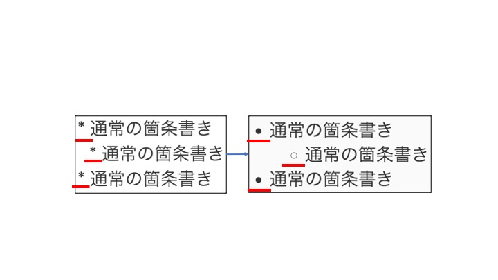
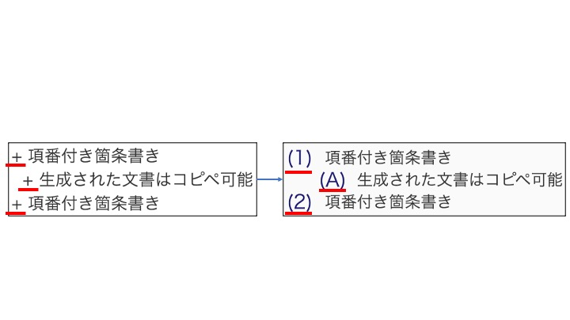
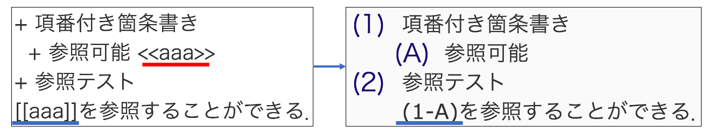

# 拡張マークダウンで文書作成

jay ではマークダウンを拡張した記法を用いて文書を作成できる．
拡張した記法は以下の2つである．
## 箇条書きの拡張
項番付きの箇条書きと通常の箇条書きの2種類を使用することができる．
"\*": 通常の箇条書き

"+": 項番付きの箇条書き
css に頼らないため，コピペできる．

## クロスリファレンス
ラベルをつけることで参照することできる．
"<\<name\>>": ラベル
"[\[name\]]": ラベルに対する参照（後方参照可能）

