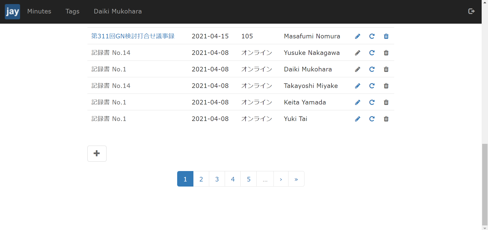
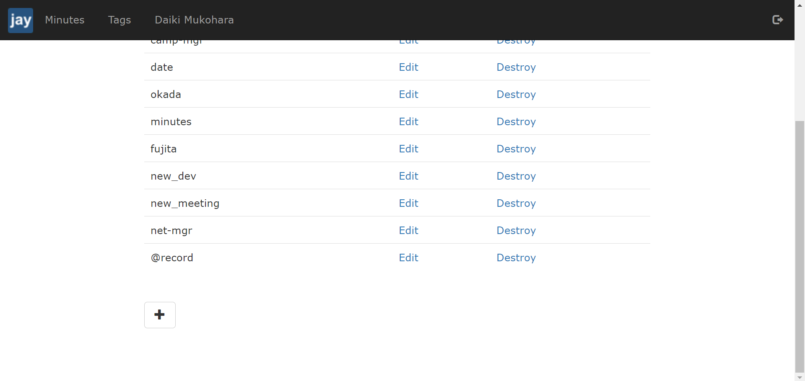

# ログイン方法 
下の画像の右上のアイコンをクリックする．  

  

次に，下の画像のページに飛ぶので，GitHub のアカウント情報を用いてログインする．  

  

# 基本的なUIの説明

## 記事の管理・記事の新規作成
ヘッダにある Minutes をクリックすると下の画像のように，現在投稿されている記事の一覧を確認することができる．  
また，ページの下部にある "+" のアイコンをクリックすると新しい記事を作成することができる．  

     

## タグの管理・タグの新規登録
ヘッダにある Tags をクリックすると下の画像のように，現在登録されているタグの一覧を確認することができる．  
また，ページの下部にある "+" のアイコンをクリックすると新しいタグを登録することができる．  

   
