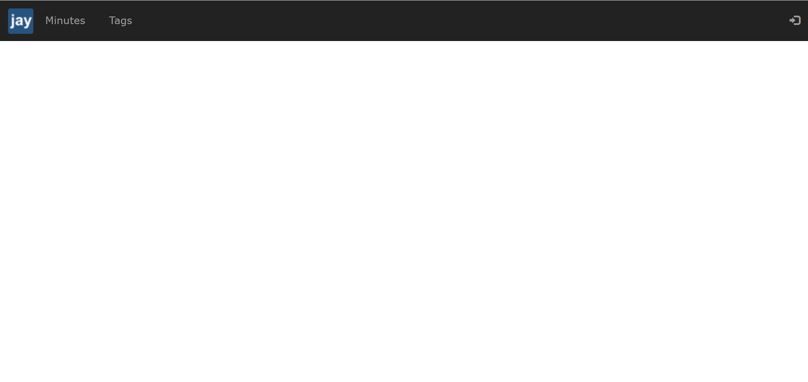

# ログイン方法 
下の画像の右上のアイコンをクリックする．

次に，下の画像のページに飛ぶので，GitHub のアカウント情報を用いてログインする．

# 基本的なUIの説明
ヘッダにある Minutes をクリックすると下の画像のように，現在投稿されている記事の一覧を確認することができる．

ヘッダにある Tags をクリックすると下の画像のように，現在登録されているタグの一覧を確認することができる．

